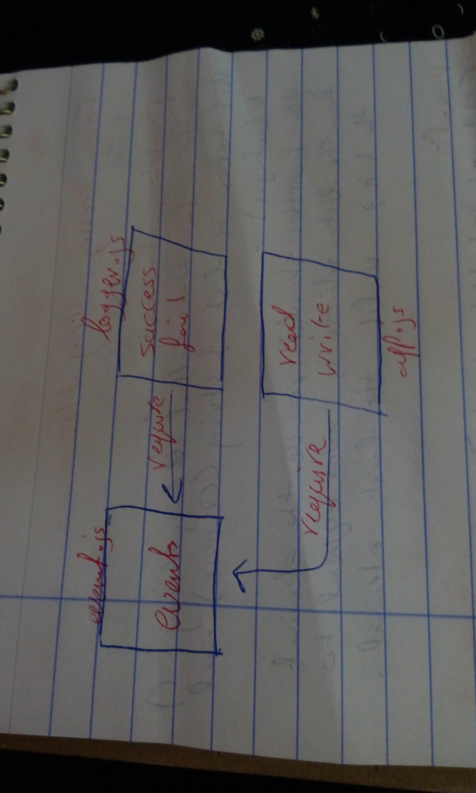

# LAB - Class 17

##  TCP Server / Message Application

### Author: Saja Swalgah

### Links and Resources

- [submission PR](https://github.com/Saja-401-advanced-javascript/lab-17/pull/1)

#### How to initialize/run your application (where applicable)

-  `npm run start`

#### UML

